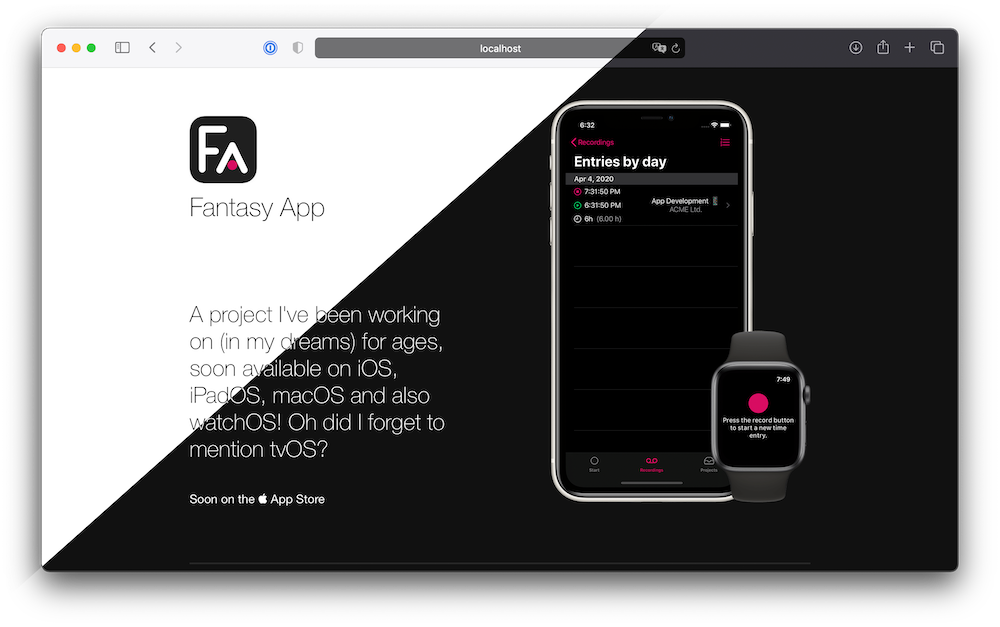

# AppLandingPage

A sample project for a static landing page for iOS apps, using Publish.



See the [live demo here](https://app-landingpage-demo.bearologics.dev/).

## 🚀 Getting started

1. Fork / Clone this repository and enter the directory

```
$ git clone git@github.com:Bearologics/AppLandingPage.git && cd $_
```

2. Inside the clones directory, open the project using Xcode

```
$ open Package.swift
```

3. Adjust `main.swift` to suit your needs and build the project. You'll find the statically generated Landingpage inside the `./Output` folder.

## 🍭 Bonus

Grab an "Download on the App Store"-Badge from [Apple's Marketing Material](https://developer.apple.com/app-store/marketing/guidelines/#section-badges) (those haven't been included due to licensing reasons).

You could then include them in `Landingpage.swift` in the `a(forAppStore link: AppStoreLink?) -> Node` function.

## License

See [LICENSE.md](LICENSE.md).
